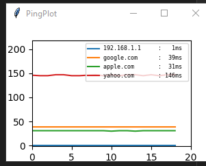

## PingPlot

Small app, which plots latency values to different servers. Latency values are based on ping system utility

Support OS: Win

Dependencies: Python, matplotlib, tkinker

How to run: pingPlot.bat

UI example:

